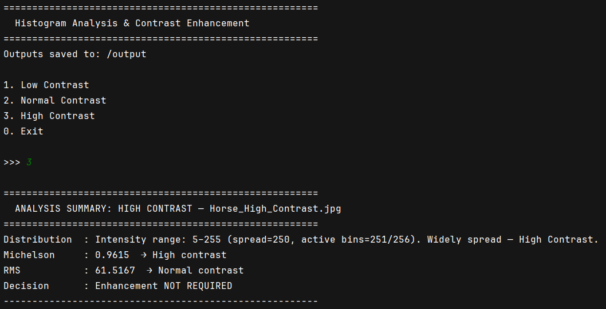
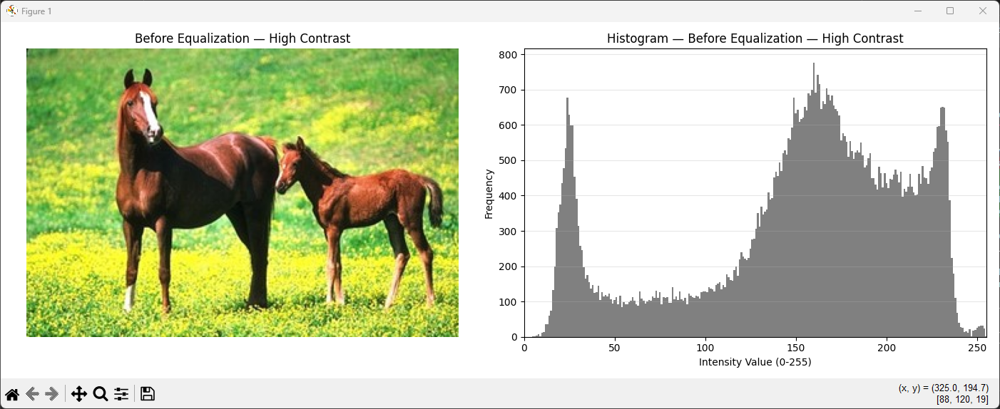
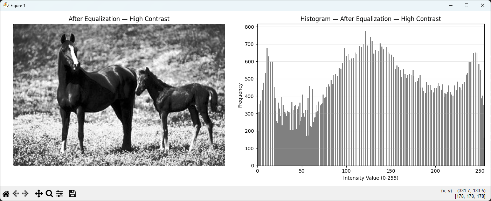

# Histogram Analysis 

Histogram computation, contrast measurement, and histogram equalization in Python.


## Team
- [@HsnAQA - Hassan Asiri](https://github.com/HsnAQA) 
- [@nullMuath - Muath](https://github.com/nullMuath)
- [@MeCaveman - MeCaveman](https://github.com/MeCaveman)
- [@WallySa7](https://github.com/WallySa7)
- [@Abdullah ](https://github.com/Abdullah-Aljadani)

## What It Does

- Converts RGB images to grayscale and builds a histogram manually
- Measures contrast using **Michelson** (min/max range) and **RMS** (standard deviation) metrics
- Classifies images as Low / Normal / High contrast
- Applies **histogram equalization** to all images and shows the before/after result
- Runs multiple images sequentially with a console summary and before/after visualization

## Project Structure

```
src/
├── App.py                        # Full pipeline — runs all tasks end to end
└── tasks/
    ├── histogram_computation.py  # Task 1
    ├── contrast_measurement.py   # Task 2
    └── histogram_equalization.py # Task 3
output/                           # Generated images and histogram plots (gitignored)
```

## Examples

### Input Images
| Low Contrast                            | Normal Contrast | High Contrast                             |
|-----------------------------------------|---|-------------------------------------------|
|  |  |  |

### App in Action

**Console output**



**Before equalization — image + histogram**


**After equalization — image + histogram**


## Requirements

```
pip install jes4py --no-deps matplotlib simpleaudio wxPython
```

## Usage

Run the full pipeline (Tasks 1–4):
```
python src/App.py
```

A menu appears with three categories: **1** Low Contrast, **2** Normal Contrast, **3** High Contrast, **0** Exit.

1. Enter a category number.
2. A file picker opens — select your image.
3. The app prints a contrast summary to the console (Michelson, RMS, enhancement decision), then opens two windows: the original grayscale image with its histogram, then the equalized image with its new histogram. Close each window to advance.
4. The menu reappears — repeat for as many images as you like, then enter **0** to exit.

All output images are saved to the `output/` folder locally in the project file.

Each task can also be run independently:
```
python src/tasks/histogram_computation.py
python src/tasks/contrast_measurement.py
python src/tasks/histogram_equalization.py
```

